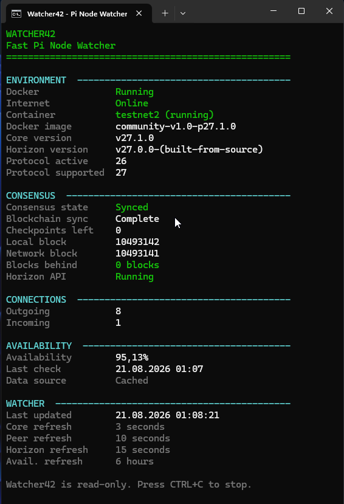
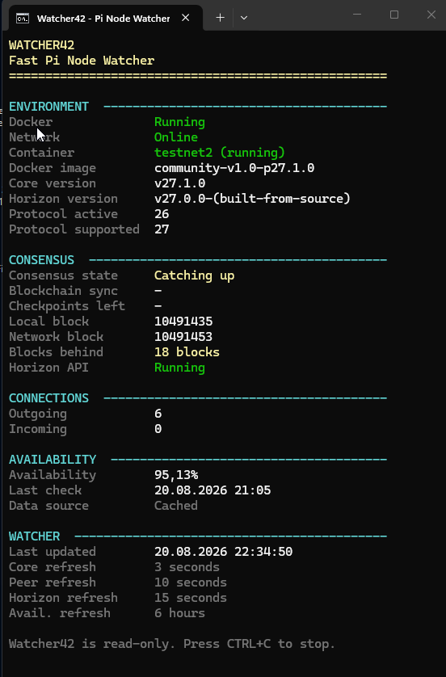
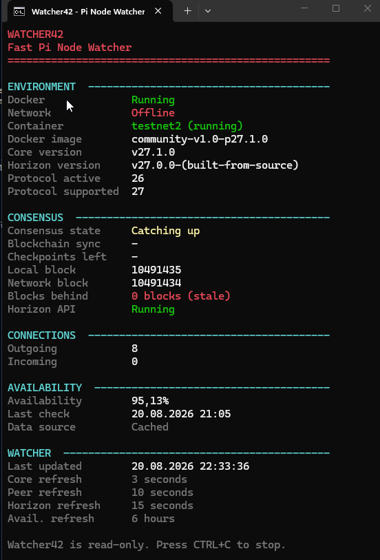
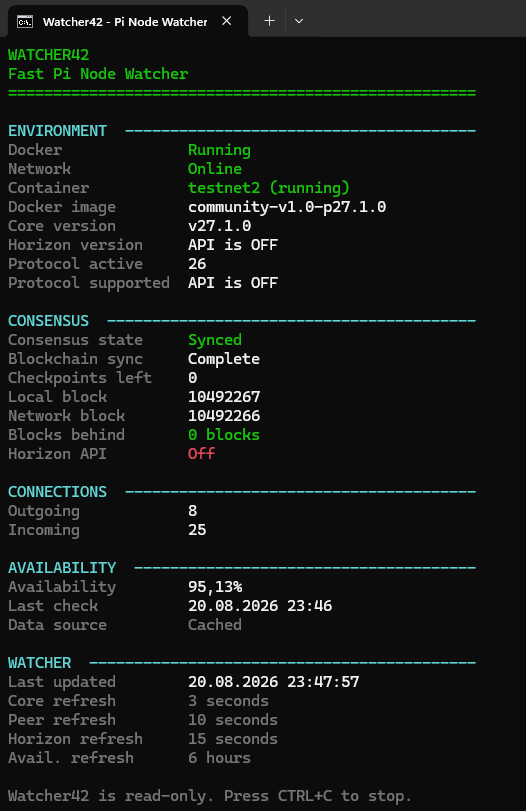
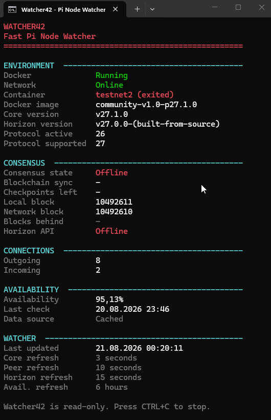
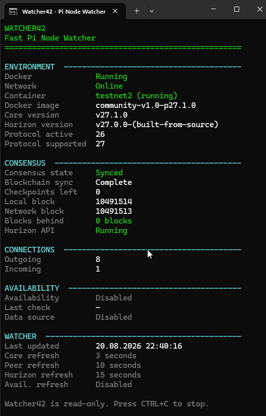

# Watcher42

**Fast Pi Node Watcher for Windows**

Watcher42 is a lightweight, read-only monitoring tool for Pi Node.  
It runs as a PowerShell script on the Windows host and reads information from Docker, the Pi Node container and the local Horizon API.

## What it shows

- Docker and Pi Node container status
- Internet connectivity status
- Docker image
- Core version
- Horizon version
- Active network protocol version
- Supported protocol version
- Consensus state and blockchain sync
- Local and network block
- Blocks behind
- Horizon API status
- Incoming and outgoing connections
- Pi Node availability
- Refresh status

## Status examples

Watcher42 uses green, yellow and red status indicators to make the current Node state easy to recognize.

### Catching up

A yellow state indicates that the Node is running but still catching up with the network.

### Internet offline

Watcher42 checks Internet connectivity separately from the Pi Node state. This helps distinguish an Internet connection problem from a Node synchronization problem.

### Horizon API off

If the local Horizon API is disabled, Watcher42 continues displaying information that is still available and clearly marks Horizon-dependent information as unavailable.

### Pi Node container offline

Watcher42 detects when the Pi Node container is stopped or exited.

### Availability monitoring disabled

Availability monitoring is optional and can be disabled in `config.json`.

## Availability history

Watcher42 can keep a local `availability.json` history.

- One availability value per day
- Newest entries stored first
- Existing history is preserved
- Availability monitoring can be disabled in `config.json`

`IMPORT_HISTORY.bat` can import and merge an `availability.json` from a previous Watcher42 version. Existing data is backed up before importing.

## Requirements

- Windows 10 or Windows 11
- Docker Desktop
- Pi Node / Pi Desktop
- Windows PowerShell

## Installation

1. Download the latest Watcher42 ZIP from **Releases**.
2. Extract the ZIP.
3. Run `START_WATCHER42.bat`.
4. Press `CTRL+C` to stop Watcher42.

No installation is required.

## Configuration

Basic settings can be changed in `config.json`, including refresh intervals, container name and availability monitoring.

## Read-only

Watcher42 is designed as a monitoring tool only.

It does **not** restart Docker or Pi Node, change Pi Node settings, modify Docker configuration, or modify blockchain data.

## Current version

**Watcher42 v1.2**

Tested on Windows 10 and Windows 11.

## License

Watcher42 is licensed under the **GNU General Public License v3.0 (GPL-3.0)**.

You are free to use, study, modify and redistribute Watcher42 under the terms of the GPL-3.0 license.

---

Watcher42 is an independent community tool and is not an official Pi Network application.
